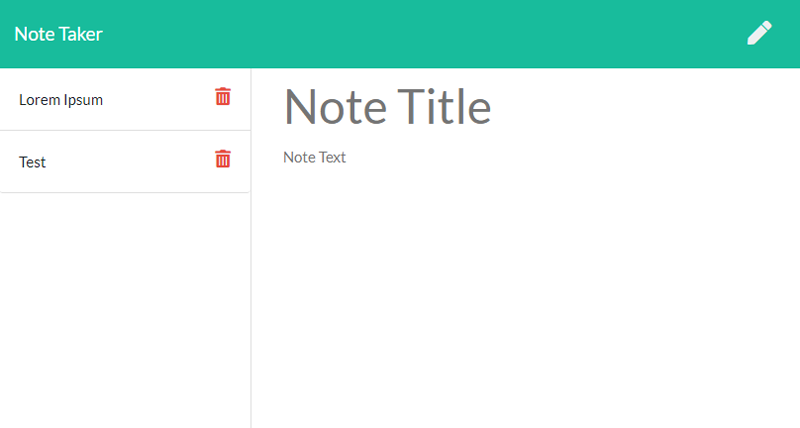

# note-taker
[](https://opensource.org/licenses/ISC)
## Description
An application for taking and saving notes, written with a node.js back-end. It allows note to be saved with title and text to a server "database" for later viewing by any visitors to the application. Notes can also be deleted.

This is an exercise in Express.js and basic API implementation.

## Table of Contents
* [Installation](#Installation)
* [Usage](#Usage)
* [Screenshot](#Screenshot)
* [Deployment](#Deployment)
* [License](#License)
* [Questions](#Questions)
* [Credits](#Credits)

## Installation
To install, run the following command:
```
npm install
```

## Usage
Requires node.js to run. Start server with
```
npm start
```

## Screenshot
  

## Deployment
The web application has been deployed on Heroku at http://malenchite-note-taker.herokuapp.com

## License  
This application is covered under the **ISC** license. More info can be found here: [ISC](https://opensource.org/licenses/ISC)

## Questions
Questions about the project? You can contact me at malenchite@gmail.com or check out my GitHub profile at [malenchite](https://github.com/malenchite)

## Credits
### NPM Packages:
* [express](https://www.npmjs.com/package/express)  
* [uniqid](https://www.npmjs.com/package/uniqid)  
* [cors](https://www.npmjs.com/package/cors)

Front-end HTML, CSS, and JS were provided as part of an assignment for the UNC Coding Bootcamp.
